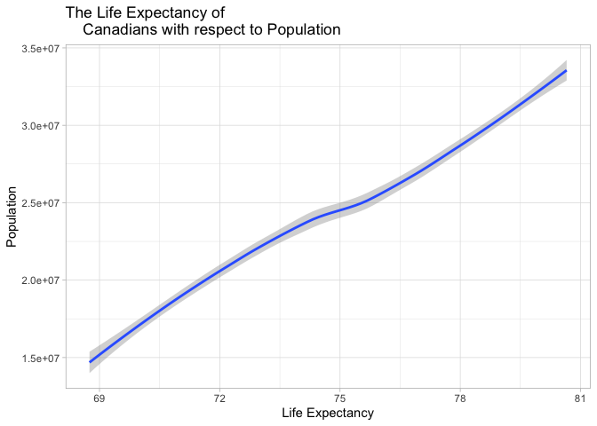

# Exercise 1
## 1.1 Filter
Use `filter()` to subset the `gapminder` data to three countries of your choice in the 1970’s.

```r
filtered <- gapminder %>%
  arrange(year) %>%
  filter(year > 1969, year < 1980, country == "Canada" | country == "Mexico" 
    | country == "Brazil") %>%
  arrange(country)
<<<<<<< HEAD
knitr::kable(filtered)
```

<table>
=======
knitr::kable(filtered) %>%
  kable_styling(bootstrap_options = "striped")
```

<table class="table table-striped" style="margin-left: auto; margin-right: auto;">
>>>>>>> 1ca241f8288cec53a6f6659df35e11a33da8fe2c
 <thead>
  <tr>
   <th style="text-align:left;"> country </th>
   <th style="text-align:left;"> continent </th>
   <th style="text-align:right;"> year </th>
   <th style="text-align:right;"> lifeExp </th>
   <th style="text-align:right;"> pop </th>
   <th style="text-align:right;"> gdpPercap </th>
  </tr>
 </thead>
<tbody>
  <tr>
   <td style="text-align:left;"> Brazil </td>
   <td style="text-align:left;"> Americas </td>
   <td style="text-align:right;"> 1972 </td>
   <td style="text-align:right;"> 59.504 </td>
   <td style="text-align:right;"> 100840058 </td>
   <td style="text-align:right;"> 4985.711 </td>
  </tr>
  <tr>
   <td style="text-align:left;"> Brazil </td>
   <td style="text-align:left;"> Americas </td>
   <td style="text-align:right;"> 1977 </td>
   <td style="text-align:right;"> 61.489 </td>
   <td style="text-align:right;"> 114313951 </td>
   <td style="text-align:right;"> 6660.119 </td>
  </tr>
  <tr>
   <td style="text-align:left;"> Canada </td>
   <td style="text-align:left;"> Americas </td>
   <td style="text-align:right;"> 1972 </td>
   <td style="text-align:right;"> 72.880 </td>
   <td style="text-align:right;"> 22284500 </td>
   <td style="text-align:right;"> 18970.571 </td>
  </tr>
  <tr>
   <td style="text-align:left;"> Canada </td>
   <td style="text-align:left;"> Americas </td>
   <td style="text-align:right;"> 1977 </td>
   <td style="text-align:right;"> 74.210 </td>
   <td style="text-align:right;"> 23796400 </td>
   <td style="text-align:right;"> 22090.883 </td>
  </tr>
  <tr>
   <td style="text-align:left;"> Mexico </td>
   <td style="text-align:left;"> Americas </td>
   <td style="text-align:right;"> 1972 </td>
   <td style="text-align:right;"> 62.361 </td>
   <td style="text-align:right;"> 55984294 </td>
   <td style="text-align:right;"> 6809.407 </td>
  </tr>
  <tr>
   <td style="text-align:left;"> Mexico </td>
   <td style="text-align:left;"> Americas </td>
   <td style="text-align:right;"> 1977 </td>
   <td style="text-align:right;"> 65.032 </td>
   <td style="text-align:right;"> 63759976 </td>
   <td style="text-align:right;"> 7674.929 </td>
  </tr>
</tbody>
</table>


## 1.2 Pipe Operator
Use the pipe operator %>% to select “country” and “gdpPercap” from your filtered dataset in 1.1.


```r
filtered %>%
  select(country, gdpPercap) 
```

```
## # A tibble: 6 x 2
##   country gdpPercap
##   <fct>       <dbl>
## 1 Brazil      4986.
## 2 Brazil      6660.
## 3 Canada     18971.
## 4 Canada     22091.
## 5 Mexico      6809.
## 6 Mexico      7675.
```

## 1.3 Drop in Life Expectancy
Filter gapminder to all entries that have experienced a drop in life expectancy. Be sure to include a new variable that's the increase in life expectancy in your tibble. Hint: you might find the lag() or diff() functions useful.


```r
gapminder %>%
  group_by(country) %>%
  arrange(country,year) %>%
  mutate(change_LE=lifeExp-lag(lifeExp)) %>%
  filter(change_LE<0) 
```

```
## # A tibble: 102 x 7
## # Groups:   country [52]
##    country  continent  year lifeExp     pop gdpPercap change_LE
##    <fct>    <fct>     <int>   <dbl>   <int>     <dbl>     <dbl>
##  1 Albania  Europe     1992    71.6 3326498     2497.    -0.419
##  2 Angola   Africa     1987    39.9 7874230     2430.    -0.036
##  3 Benin    Africa     2002    54.4 7026113     1373.    -0.371
##  4 Botswana Africa     1992    62.7 1342614     7954.    -0.877
##  5 Botswana Africa     1997    52.6 1536536     8647.   -10.2  
##  6 Botswana Africa     2002    46.6 1630347    11004.    -5.92 
##  7 Bulgaria Europe     1977    70.8 8797022     7612.    -0.09 
##  8 Bulgaria Europe     1992    71.2 8658506     6303.    -0.15 
##  9 Bulgaria Europe     1997    70.3 8066057     5970.    -0.87 
## 10 Burundi  Africa     1992    44.7 5809236      632.    -3.48 
## # … with 92 more rows
```

## 1.4 Max

Choose one of the following:

**Filter gapminder so that it shows the max GDP per capita experienced by each country. 
    Hint: you might find the max() function useful here.**

OR

Filter gapminder to contain six rows: the rows with the three largest GDP per capita, 
 and the rows with the three smallest GDP per capita. Be sure to not create any 
intermediate objects when doing this (with, for example, the assignment operator). 
Hint: you might find the sort() function useful, or perhaps even the dplyr::slice() function.


```r
gapminder %>%
  group_by(country) %>%
  arrange(country,gdpPercap) %>%
  filter(gdpPercap==max(gdpPercap))
```

```
## # A tibble: 142 x 6
## # Groups:   country [142]
##    country     continent  year lifeExp       pop gdpPercap
##    <fct>       <fct>     <int>   <dbl>     <int>     <dbl>
##  1 Afghanistan Asia       1982    39.9  12881816      978.
##  2 Albania     Europe     2007    76.4   3600523     5937.
##  3 Algeria     Africa     2007    72.3  33333216     6223.
##  4 Angola      Africa     1967    36.0   5247469     5523.
##  5 Argentina   Americas   2007    75.3  40301927    12779.
##  6 Australia   Oceania    2007    81.2  20434176    34435.
##  7 Austria     Europe     2007    79.8   8199783    36126.
##  8 Bahrain     Asia       2007    75.6    708573    29796.
##  9 Bangladesh  Asia       2007    64.1 150448339     1391.
## 10 Belgium     Europe     2007    79.4  10392226    33693.
## # … with 132 more rows
```

## 1.5 Scatterplot

Produce a scatterplot of Canada’s life expectancy vs. GDP per capita using ggplot2, without defining a new variable. That is, after filtering the gapminder data set, pipe it directly into the ggplot() function. Ensure GDP per capita is on a log scale.


```r
gapminder %>%
  filter(country == "Canada") %>%
  ggplot(aes(x=log(gdpPercap),lifeExp)) +
  scale_x_log10(limits=c(9,11)) +
  geom_point(colour="blue") +
  labs(x="log(GDP per capita)",
    y="Life Expectancy", 
    title="Canada's Life Expectancy Increases with GDP per capita") +
  theme_bw()
```

<!-- -->

# Exercise 2

Pick one categorical variable and one quantitative variable to explore. Answer the following questions in whichever way you think is appropriate, using dplyr:
What are possible values (or range, whichever is appropriate) of each variable?
What values are typical? What’s the spread? What’s the distribution? Etc., tailored to the variable at hand.
Feel free to use summary stats, tables, figures.

## 2.1 Gapminder Continent

For this exercise, we will use `continent` as a categorical variable and `pop` as quantitative variable from the  `gapminder` data set.

We can see that there are 5 continents: **Africa, Asia, Europe, Americas, and Oceania**
 Africa has the most number of continents and Oceania with the fewest countries.

```r
  gapminder %>% 
  arrange(country)%>%
  filter(year == 1952) %>% 
  mutate(continent = fct_infreq(continent)) %>% 
  ggplot(aes(continent)) +
  geom_bar(colour="3",fill="3") +
  labs(x="Continent",
    y="Number of Countries", 
    title="Number of Countries per Continent") +
  theme_bw()
```

<!-- -->

We can also view this data as a table:

```r
gapminder %>% 
  filter(year == 1952) %>% 
  group_by(continent) %>% 
  summarize(number_of_countries = mean(length(country)))
```

```
## # A tibble: 5 x 2
##   continent number_of_countries
##   <fct>                   <dbl>
## 1 Africa                     52
## 2 Americas                   25
## 3 Asia                       33
## 4 Europe                     30
## 5 Oceania                     2
```

## 2.2 Gapminder Pop

The mean population of the continents over the years are shown below:

```r
gapminder %>% 
  group_by(continent) %>%
  summarize(mean_popuplation=mean(pop))
```

```
## # A tibble: 5 x 2
##   continent mean_popuplation
##   <fct>                <dbl>
## 1 Africa            9916003.
## 2 Americas         24504795.
## 3 Asia             77038722.
## 4 Europe           17169765.
## 5 Oceania           8874672.
```

The standard error of the population per country is shown below:

```r
gapminder %>%
  group_by(continent) %>%
  summarize(stdE_pop = sd(pop)/sqrt(n()))
```

```
## # A tibble: 5 x 2
##   continent  stdE_pop
##   <fct>         <dbl>
## 1 Africa      620133.
## 2 Americas   2943299.
## 3 Asia      10396373.
## 4 Europe     1081469.
## 5 Oceania    1328102.
```

The ranges of population for each continent is shown below:

```r
gapminder %>%
  group_by(continent) %>%
  summarize(min(pop),max(pop))
```

```
## # A tibble: 5 x 3
##   continent `min(pop)` `max(pop)`
##   <fct>          <int>      <int>
## 1 Africa         60011  135031164
## 2 Americas      662850  301139947
## 3 Asia          120447 1318683096
## 4 Europe        147962   82400996
## 5 Oceania      1994794   20434176
```

This shows that Asia has the most population at 1,318,683,096 and Africa had the least at 60,011. Hence, the range of population amongst all continents is from 60,011 to 1,318,683,096

# Exercise 3
  
  Make two plots that have some value to them. That is, plots that someone might actually consider making for an analysis. Just don’t make the same plots we made in class – feel free to use a data set from the datasets R package if you wish.

    A scatterplot of two quantitative variables.
    One other plot besides a scatterplot.

You don’t have to use all the data in every plot! It’s fine to filter down to one country or a small handful of countries.

## 3.1 Scatterplot

For this exercise, we will explore the relationship between the population and the life expectancy of Canada.


```r
gapminder %>%
  filter(country=="Canada") %>%
  ggplot(aes(pop, lifeExp, pop)) +
  geom_point()+
<<<<<<< HEAD
  labs(y="Life Expectancy", x="Population", title="The Life Expectancy of 
    Canadians with respect to Population") +
=======
  labs(y="Life Expectancy", x="Population", title="The Life Expectancy of Canadians with respect to Population") +
>>>>>>> 1ca241f8288cec53a6f6659df35e11a33da8fe2c
  theme_light()
```

<!-- -->

From this plot, we can observe the increase in Canadian life expectancy as population increases. This may be due to the increase in caretakers available for the aged population, more people pursue research that promote longevity and improved quality of life.

## 3.2 Smooth plot

```r
gapminder %>%
  filter(country=="Canada") %>%
  ggplot(aes(lifeExp, pop)) +
  geom_smooth()+
<<<<<<< HEAD
  labs(x="Life Expectancy", y="Population", title="The Life Expectancy of 
    Canadians with respect to Population") +
=======
  labs(x="Life Expectancy", y="Population", title="The Life Expectancy of Canadians with respect to Population") +
>>>>>>> 1ca241f8288cec53a6f6659df35e11a33da8fe2c
  theme_light()
```

```
## `geom_smooth()` using method = 'loess' and formula 'y ~ x'
```

<!-- -->

# Bonus

## Bonus 1

For people who want to take things further.

Evaluate this code and describe the result. Presumably the analyst’s intent was to get the data for Rwanda and Afghanistan. Did they succeed? Why or why not? If not, what is the correct way to do this?

filter(gapminder, country == c("Rwanda", "Afghanistan"))


```r
x<-filter(gapminder, country == c("Rwanda", "Afghanistan")) 
<<<<<<< HEAD
knitr::kable(x)
```

<table>
=======
knitr::kable(x) %>%
  kable_styling("hover",full_width = T)
```

<table class="table table-hover" style="margin-left: auto; margin-right: auto;">
>>>>>>> 1ca241f8288cec53a6f6659df35e11a33da8fe2c
 <thead>
  <tr>
   <th style="text-align:left;"> country </th>
   <th style="text-align:left;"> continent </th>
   <th style="text-align:right;"> year </th>
   <th style="text-align:right;"> lifeExp </th>
   <th style="text-align:right;"> pop </th>
   <th style="text-align:right;"> gdpPercap </th>
  </tr>
 </thead>
<tbody>
  <tr>
   <td style="text-align:left;"> Afghanistan </td>
   <td style="text-align:left;"> Asia </td>
   <td style="text-align:right;"> 1957 </td>
   <td style="text-align:right;"> 30.332 </td>
   <td style="text-align:right;"> 9240934 </td>
   <td style="text-align:right;"> 820.8530 </td>
  </tr>
  <tr>
   <td style="text-align:left;"> Afghanistan </td>
   <td style="text-align:left;"> Asia </td>
   <td style="text-align:right;"> 1967 </td>
   <td style="text-align:right;"> 34.020 </td>
   <td style="text-align:right;"> 11537966 </td>
   <td style="text-align:right;"> 836.1971 </td>
  </tr>
  <tr>
   <td style="text-align:left;"> Afghanistan </td>
   <td style="text-align:left;"> Asia </td>
   <td style="text-align:right;"> 1977 </td>
   <td style="text-align:right;"> 38.438 </td>
   <td style="text-align:right;"> 14880372 </td>
   <td style="text-align:right;"> 786.1134 </td>
  </tr>
  <tr>
   <td style="text-align:left;"> Afghanistan </td>
   <td style="text-align:left;"> Asia </td>
   <td style="text-align:right;"> 1987 </td>
   <td style="text-align:right;"> 40.822 </td>
   <td style="text-align:right;"> 13867957 </td>
   <td style="text-align:right;"> 852.3959 </td>
  </tr>
  <tr>
   <td style="text-align:left;"> Afghanistan </td>
   <td style="text-align:left;"> Asia </td>
   <td style="text-align:right;"> 1997 </td>
   <td style="text-align:right;"> 41.763 </td>
   <td style="text-align:right;"> 22227415 </td>
   <td style="text-align:right;"> 635.3414 </td>
  </tr>
  <tr>
   <td style="text-align:left;"> Afghanistan </td>
   <td style="text-align:left;"> Asia </td>
   <td style="text-align:right;"> 2007 </td>
   <td style="text-align:right;"> 43.828 </td>
   <td style="text-align:right;"> 31889923 </td>
   <td style="text-align:right;"> 974.5803 </td>
  </tr>
  <tr>
   <td style="text-align:left;"> Rwanda </td>
   <td style="text-align:left;"> Africa </td>
   <td style="text-align:right;"> 1952 </td>
   <td style="text-align:right;"> 40.000 </td>
   <td style="text-align:right;"> 2534927 </td>
   <td style="text-align:right;"> 493.3239 </td>
  </tr>
  <tr>
   <td style="text-align:left;"> Rwanda </td>
   <td style="text-align:left;"> Africa </td>
   <td style="text-align:right;"> 1962 </td>
   <td style="text-align:right;"> 43.000 </td>
   <td style="text-align:right;"> 3051242 </td>
   <td style="text-align:right;"> 597.4731 </td>
  </tr>
  <tr>
   <td style="text-align:left;"> Rwanda </td>
   <td style="text-align:left;"> Africa </td>
   <td style="text-align:right;"> 1972 </td>
   <td style="text-align:right;"> 44.600 </td>
   <td style="text-align:right;"> 3992121 </td>
   <td style="text-align:right;"> 590.5807 </td>
  </tr>
  <tr>
   <td style="text-align:left;"> Rwanda </td>
   <td style="text-align:left;"> Africa </td>
   <td style="text-align:right;"> 1982 </td>
   <td style="text-align:right;"> 46.218 </td>
   <td style="text-align:right;"> 5507565 </td>
   <td style="text-align:right;"> 881.5706 </td>
  </tr>
  <tr>
   <td style="text-align:left;"> Rwanda </td>
   <td style="text-align:left;"> Africa </td>
   <td style="text-align:right;"> 1992 </td>
   <td style="text-align:right;"> 23.599 </td>
   <td style="text-align:right;"> 7290203 </td>
   <td style="text-align:right;"> 737.0686 </td>
  </tr>
  <tr>
   <td style="text-align:left;"> Rwanda </td>
   <td style="text-align:left;"> Africa </td>
   <td style="text-align:right;"> 2002 </td>
   <td style="text-align:right;"> 43.413 </td>
   <td style="text-align:right;"> 7852401 </td>
   <td style="text-align:right;"> 785.6538 </td>
  </tr>
</tbody>
</table>
Upon entering that code, the gapminder data for Rwanda and Afghanistan appear and the analyst can continue to work on it (e.g. via piping)

## Bonus 2

Present numerical tables in a more attractive form using knitr::kable() for small tibbles (say, up to 10 rows), and DT::datatable() for larger tibbles.

<<<<<<< HEAD
*Please refer to Exercise 1.1 and Bonus 1*
=======
* Please refer to Exercise 1.1 and Bonus 1*
>>>>>>> 1ca241f8288cec53a6f6659df35e11a33da8fe2c
