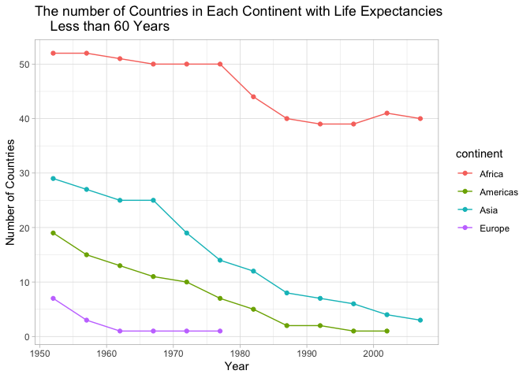
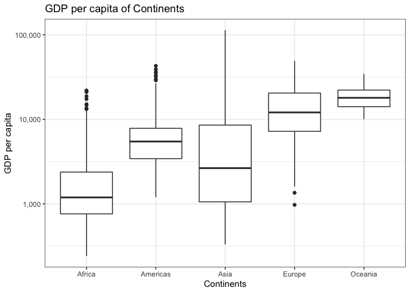

# Instructions

Pick three of the six tasks below, and produce:

* a tibble, using dplyr as your data manipulation tool
* an accompanying plot of data from the tibble, using ggplot2 as your visualization tool
* some dialogue about what your tables/figures show (doesn’t have to be much).

Or, make up your own task(s)! If you want to do something comparable but different, i.e. swap one quantitative variable for another, be my guest! If you are feeling inspired and curious, then we’re doing this right. Go for it. Just write down the task that you are now doing. Between the dplyr coverage in class and the list below, I think you get the idea.


# Tasks

## **Task Option 1**
Report the absolute and/or relative abundance of countries with low life expectancy over time by continent: Compute some measure of worldwide life expectancy – you decide – a mean or median or some other quantile or perhaps your current age. Then determine how many countries on each continent have a life expectancy less than this benchmark, for each year.


```r
t1<-gapminder %>% 
  select(continent,year,lifeExp) %>% 
  group_by(year,continent) %>% 
  filter(lifeExp<60) %>%
  group_by(year,continent) %>% 
  summarize(low_LifeExp=length(continent))
  knitr::kable(t1) %>% 
    kable_styling("striped",latex_options="basic",full_width=FALSE,position="center")
```

<table class="table table-striped" style="width: auto !important; margin-left: auto; margin-right: auto;">
 <thead>
  <tr>
   <th style="text-align:right;"> year </th>
   <th style="text-align:left;"> continent </th>
   <th style="text-align:right;"> low_LifeExp </th>
  </tr>
 </thead>
<tbody>
  <tr>
   <td style="text-align:right;"> 1952 </td>
   <td style="text-align:left;"> Africa </td>
   <td style="text-align:right;"> 52 </td>
  </tr>
  <tr>
   <td style="text-align:right;"> 1952 </td>
   <td style="text-align:left;"> Americas </td>
   <td style="text-align:right;"> 19 </td>
  </tr>
  <tr>
   <td style="text-align:right;"> 1952 </td>
   <td style="text-align:left;"> Asia </td>
   <td style="text-align:right;"> 29 </td>
  </tr>
  <tr>
   <td style="text-align:right;"> 1952 </td>
   <td style="text-align:left;"> Europe </td>
   <td style="text-align:right;"> 7 </td>
  </tr>
  <tr>
   <td style="text-align:right;"> 1957 </td>
   <td style="text-align:left;"> Africa </td>
   <td style="text-align:right;"> 52 </td>
  </tr>
  <tr>
   <td style="text-align:right;"> 1957 </td>
   <td style="text-align:left;"> Americas </td>
   <td style="text-align:right;"> 15 </td>
  </tr>
  <tr>
   <td style="text-align:right;"> 1957 </td>
   <td style="text-align:left;"> Asia </td>
   <td style="text-align:right;"> 27 </td>
  </tr>
  <tr>
   <td style="text-align:right;"> 1957 </td>
   <td style="text-align:left;"> Europe </td>
   <td style="text-align:right;"> 3 </td>
  </tr>
  <tr>
   <td style="text-align:right;"> 1962 </td>
   <td style="text-align:left;"> Africa </td>
   <td style="text-align:right;"> 51 </td>
  </tr>
  <tr>
   <td style="text-align:right;"> 1962 </td>
   <td style="text-align:left;"> Americas </td>
   <td style="text-align:right;"> 13 </td>
  </tr>
  <tr>
   <td style="text-align:right;"> 1962 </td>
   <td style="text-align:left;"> Asia </td>
   <td style="text-align:right;"> 25 </td>
  </tr>
  <tr>
   <td style="text-align:right;"> 1962 </td>
   <td style="text-align:left;"> Europe </td>
   <td style="text-align:right;"> 1 </td>
  </tr>
  <tr>
   <td style="text-align:right;"> 1967 </td>
   <td style="text-align:left;"> Africa </td>
   <td style="text-align:right;"> 50 </td>
  </tr>
  <tr>
   <td style="text-align:right;"> 1967 </td>
   <td style="text-align:left;"> Americas </td>
   <td style="text-align:right;"> 11 </td>
  </tr>
  <tr>
   <td style="text-align:right;"> 1967 </td>
   <td style="text-align:left;"> Asia </td>
   <td style="text-align:right;"> 25 </td>
  </tr>
  <tr>
   <td style="text-align:right;"> 1967 </td>
   <td style="text-align:left;"> Europe </td>
   <td style="text-align:right;"> 1 </td>
  </tr>
  <tr>
   <td style="text-align:right;"> 1972 </td>
   <td style="text-align:left;"> Africa </td>
   <td style="text-align:right;"> 50 </td>
  </tr>
  <tr>
   <td style="text-align:right;"> 1972 </td>
   <td style="text-align:left;"> Americas </td>
   <td style="text-align:right;"> 10 </td>
  </tr>
  <tr>
   <td style="text-align:right;"> 1972 </td>
   <td style="text-align:left;"> Asia </td>
   <td style="text-align:right;"> 19 </td>
  </tr>
  <tr>
   <td style="text-align:right;"> 1972 </td>
   <td style="text-align:left;"> Europe </td>
   <td style="text-align:right;"> 1 </td>
  </tr>
  <tr>
   <td style="text-align:right;"> 1977 </td>
   <td style="text-align:left;"> Africa </td>
   <td style="text-align:right;"> 50 </td>
  </tr>
  <tr>
   <td style="text-align:right;"> 1977 </td>
   <td style="text-align:left;"> Americas </td>
   <td style="text-align:right;"> 7 </td>
  </tr>
  <tr>
   <td style="text-align:right;"> 1977 </td>
   <td style="text-align:left;"> Asia </td>
   <td style="text-align:right;"> 14 </td>
  </tr>
  <tr>
   <td style="text-align:right;"> 1977 </td>
   <td style="text-align:left;"> Europe </td>
   <td style="text-align:right;"> 1 </td>
  </tr>
  <tr>
   <td style="text-align:right;"> 1982 </td>
   <td style="text-align:left;"> Africa </td>
   <td style="text-align:right;"> 44 </td>
  </tr>
  <tr>
   <td style="text-align:right;"> 1982 </td>
   <td style="text-align:left;"> Americas </td>
   <td style="text-align:right;"> 5 </td>
  </tr>
  <tr>
   <td style="text-align:right;"> 1982 </td>
   <td style="text-align:left;"> Asia </td>
   <td style="text-align:right;"> 12 </td>
  </tr>
  <tr>
   <td style="text-align:right;"> 1987 </td>
   <td style="text-align:left;"> Africa </td>
   <td style="text-align:right;"> 40 </td>
  </tr>
  <tr>
   <td style="text-align:right;"> 1987 </td>
   <td style="text-align:left;"> Americas </td>
   <td style="text-align:right;"> 2 </td>
  </tr>
  <tr>
   <td style="text-align:right;"> 1987 </td>
   <td style="text-align:left;"> Asia </td>
   <td style="text-align:right;"> 8 </td>
  </tr>
  <tr>
   <td style="text-align:right;"> 1992 </td>
   <td style="text-align:left;"> Africa </td>
   <td style="text-align:right;"> 39 </td>
  </tr>
  <tr>
   <td style="text-align:right;"> 1992 </td>
   <td style="text-align:left;"> Americas </td>
   <td style="text-align:right;"> 2 </td>
  </tr>
  <tr>
   <td style="text-align:right;"> 1992 </td>
   <td style="text-align:left;"> Asia </td>
   <td style="text-align:right;"> 7 </td>
  </tr>
  <tr>
   <td style="text-align:right;"> 1997 </td>
   <td style="text-align:left;"> Africa </td>
   <td style="text-align:right;"> 39 </td>
  </tr>
  <tr>
   <td style="text-align:right;"> 1997 </td>
   <td style="text-align:left;"> Americas </td>
   <td style="text-align:right;"> 1 </td>
  </tr>
  <tr>
   <td style="text-align:right;"> 1997 </td>
   <td style="text-align:left;"> Asia </td>
   <td style="text-align:right;"> 6 </td>
  </tr>
  <tr>
   <td style="text-align:right;"> 2002 </td>
   <td style="text-align:left;"> Africa </td>
   <td style="text-align:right;"> 41 </td>
  </tr>
  <tr>
   <td style="text-align:right;"> 2002 </td>
   <td style="text-align:left;"> Americas </td>
   <td style="text-align:right;"> 1 </td>
  </tr>
  <tr>
   <td style="text-align:right;"> 2002 </td>
   <td style="text-align:left;"> Asia </td>
   <td style="text-align:right;"> 4 </td>
  </tr>
  <tr>
   <td style="text-align:right;"> 2007 </td>
   <td style="text-align:left;"> Africa </td>
   <td style="text-align:right;"> 40 </td>
  </tr>
  <tr>
   <td style="text-align:right;"> 2007 </td>
   <td style="text-align:left;"> Asia </td>
   <td style="text-align:right;"> 3 </td>
  </tr>
</tbody>
</table>
This table enumerates the number of countries that have life expectancies less than 60 years for each continent in every year recorded.

We can also present this data graphically as follows:

```r
ggplot(t1)+
  geom_point(aes(year,low_LifeExp,group=continent,color=continent))+
  geom_path((aes(year,low_LifeExp,group=continent,color=continent)))+
  labs(x="Year",y="Number of Countries",
  title="The number of Countries in Each Continent with Life Expectancies 
    Less than 60 Years")+
  theme_light()
```


We can observe that the trends amongst the continents follow a similar path where the number of countries with life expectancies less than 60 decline throughout the years. Africa had a plateau from 1950 to late 1970's that declined sharply between late 1970 to late 1980 and then plateaud again until the late 2000's. Asia and Americas had a slow decline in the 1950's to the late 1960's then have a sharp decline from then on until it declines less rapidly from late 1980's to late 2000's. Europe had a sharp decline from 1950 to 1960 and experienced a plateau. We can attribute the decrease in the number of countries with life expectancies less than 60 as technology, sanitation, regulations, and healthcare improved througout the years.

## **Task Option 2**
Get the maximum and minimum of GDP per capita for all continents.

```r
t2<-gapminder %>% 
  select(continent,gdpPercap) %>% 
  group_by(continent) %>%
  arrange(continent)%>%
  summarize(min_GDP=min(gdpPercap),max_GDP=max(gdpPercap))
knitr::kable(t2) %>% 
  kable_styling("striped",latex_options="basic",full_width=FALSE,position="center")
```

<table class="table table-striped" style="width: auto !important; margin-left: auto; margin-right: auto;">
 <thead>
  <tr>
   <th style="text-align:left;"> continent </th>
   <th style="text-align:right;"> min_GDP </th>
   <th style="text-align:right;"> max_GDP </th>
  </tr>
 </thead>
<tbody>
  <tr>
   <td style="text-align:left;"> Africa </td>
   <td style="text-align:right;"> 241.1659 </td>
   <td style="text-align:right;"> 21951.21 </td>
  </tr>
  <tr>
   <td style="text-align:left;"> Americas </td>
   <td style="text-align:right;"> 1201.6372 </td>
   <td style="text-align:right;"> 42951.65 </td>
  </tr>
  <tr>
   <td style="text-align:left;"> Asia </td>
   <td style="text-align:right;"> 331.0000 </td>
   <td style="text-align:right;"> 113523.13 </td>
  </tr>
  <tr>
   <td style="text-align:left;"> Europe </td>
   <td style="text-align:right;"> 973.5332 </td>
   <td style="text-align:right;"> 49357.19 </td>
  </tr>
  <tr>
   <td style="text-align:left;"> Oceania </td>
   <td style="text-align:right;"> 10039.5956 </td>
   <td style="text-align:right;"> 34435.37 </td>
  </tr>
</tbody>
</table>


```r
ggplot(t2)+
  geom_point(aes(continent, min_GDP,color="min"),
    size=5, shape="square") + geom_point(aes(continent,max_GDP,colour="max"),
    size=5,shape="square",alpha=0.6)+
  geom_linerange(aes(x=continent,ymin=min_GDP,ymax=max_GDP),
    size=1,colour="dark gray",alpha=0.5)+
  labs(x="Continents",y="GDP per capita",
    title="Maximum and Minimum GDP per capita of Continents") +
  theme(legend.position="right")+ 
  theme_bw()
```


We can observe the minimum (pink box) and maximum (blue box) GDP per capita of each continent (connected by a gray line). Asia has the highest max GDP per capita while Africa has the lowest minimum GDP per capita.

## **Task Option 3**
Look at the spread of GDP per capita within the continents.

```r
gapminder %>% 
  select(continent,gdpPercap) %>% 
  group_by(continent) %>%
  summarize(mean=mean(gdpPercap),std_dev=sd(gdpPercap),
    median=median(gdpPercap),min=min(gdpPercap),max=max(gdpPercap)) %>% 
   arrange(mean) %>%
knitr::kable() %>% 
  kable_styling("striped",latex_options="basic",full_width=FALSE,position="center")
```

<table class="table table-striped" style="width: auto !important; margin-left: auto; margin-right: auto;">
 <thead>
  <tr>
   <th style="text-align:left;"> continent </th>
   <th style="text-align:right;"> mean </th>
   <th style="text-align:right;"> std_dev </th>
   <th style="text-align:right;"> median </th>
   <th style="text-align:right;"> min </th>
   <th style="text-align:right;"> max </th>
  </tr>
 </thead>
<tbody>
  <tr>
   <td style="text-align:left;"> Africa </td>
   <td style="text-align:right;"> 2193.755 </td>
   <td style="text-align:right;"> 2827.930 </td>
   <td style="text-align:right;"> 1192.138 </td>
   <td style="text-align:right;"> 241.1659 </td>
   <td style="text-align:right;"> 21951.21 </td>
  </tr>
  <tr>
   <td style="text-align:left;"> Americas </td>
   <td style="text-align:right;"> 7136.110 </td>
   <td style="text-align:right;"> 6396.764 </td>
   <td style="text-align:right;"> 5465.510 </td>
   <td style="text-align:right;"> 1201.6372 </td>
   <td style="text-align:right;"> 42951.65 </td>
  </tr>
  <tr>
   <td style="text-align:left;"> Asia </td>
   <td style="text-align:right;"> 7902.150 </td>
   <td style="text-align:right;"> 14045.373 </td>
   <td style="text-align:right;"> 2646.787 </td>
   <td style="text-align:right;"> 331.0000 </td>
   <td style="text-align:right;"> 113523.13 </td>
  </tr>
  <tr>
   <td style="text-align:left;"> Europe </td>
   <td style="text-align:right;"> 14469.476 </td>
   <td style="text-align:right;"> 9355.213 </td>
   <td style="text-align:right;"> 12081.749 </td>
   <td style="text-align:right;"> 973.5332 </td>
   <td style="text-align:right;"> 49357.19 </td>
  </tr>
  <tr>
   <td style="text-align:left;"> Oceania </td>
   <td style="text-align:right;"> 18621.609 </td>
   <td style="text-align:right;"> 6358.983 </td>
   <td style="text-align:right;"> 17983.304 </td>
   <td style="text-align:right;"> 10039.5956 </td>
   <td style="text-align:right;"> 34435.37 </td>
  </tr>
</tbody>
</table>
This table provides a summary of the dataset. It lists the continents in increasing mean GDP per capita and also provides the standard deviation (std_dev), median, minimum, and maximum GDP per capita of each continent throughout the data collection.


```r
gapminder %>% 
  select(continent,gdpPercap) %>% 
  group_by(continent) %>%
  arrange(continent)%>%
  ggplot()+
  geom_boxplot(aes(continent,gdpPercap)) +
  scale_y_log10(labels=comma)+ 
  labs(x="Continents",y="GDP per capita",
    title="GDP per capita of Continents")+
  theme_bw()
```


This is a boxplot of the GDP per capita of the various continents showing the minimum(lowest point of the vertical line), the maximum(highest point of the vertical line), and the median(horizontal line within the box) values for each continent's GDP per capita.

## ~~Task Option 4~~
Compute a trimmed mean of life expectancy for different years. Or a weighted mean, weighting by population. Just try something other than the plain vanilla mean.

## ~~Task Option 5~~
How is life expectancy changing over time on different continents?


## ~~Task Option 6~~
Find countries with interesting stories. Open-ended and, therefore, hard. Promising but unsuccessful attempts are encouraged. This will generate interesting questions to follow up on in class.

